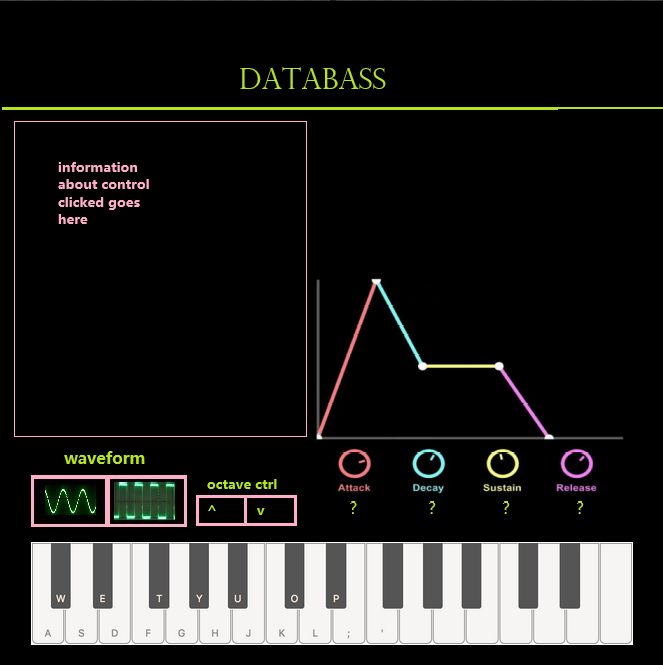

# Project Title

my app will be called "DATABASS"

## Overview

 it is a simple bass/chord synthesizer, designed to encourage learning about synthesis and experimenting with sound

### Problem

music production equipment, both hardware and software, can be very expensive. i want to try to make something that can be used for free by anyone
with an internet connection

### User Profile

musicians could implement this into their regular creative workflow, or non-musicians interested in playing around with synthesis or just music software in general, but don't want to commit to heavy costs of professional software

### Features

I would like to implement a playable keyboard, along with basic parameters for manipulating the sound generated

## Implementation

### Tech Stack

react
node
sass
tone.js (web audio api)
mui

### APIs

 i will create an api to serve information about what each of the controls on the synth do

### Sitemap

homepage - 
    this will be the initial page you see when you load the app, 
    it will have a brief description of what the app is and what it does.
    will have an 'play' button to go to the instrument page, and a 'helpme'
    button that goes to the information page

instrument page -
    this will be a visual representation of a synthesizer,
    including a piano keyboard with 12 keys, and controls to 
    select different mode of audio output. for example, which type of soundwave to generate,
    octave switch, ADSR controls.

    these controls will include a little tooltip next to them to display what it is that they do,
    this info will be served  from my api so that i can create just one modal and display all the different 
    info from that depending on which is called

### Mockups

### Data

Describe your data and the relationships between them. You can show this visually using diagrams, or write it out. 

### Endpoints

so far only needs front end endpoints so

/ for homepage

/help for help page

/play for play page

### Auth

Does your project include any login or user profile functionality? If so, describe how authentication/authorization will be implemented.

## Roadmap

Scope your project as a sprint. Break down the tasks that will need to be completed and map out timeframes for implementation. Think about what you can reasonably complete before the due date. The more detail you provide, the easier it will be to build.

designing front end for each of the three pages, including finding/building any reusable components

functionality of making sounds with key press, and allowing choice between multiple types of soundwaves via button or slider, choosing octave range, adsr controls

## Nice-to-haves

Your project will be marked based on what you committed to in the above document. Under nice-to-haves, you can list any additional features you may complete if you have extra time, or after finishing.

more effects, saving patch functionality, record/loop functionality