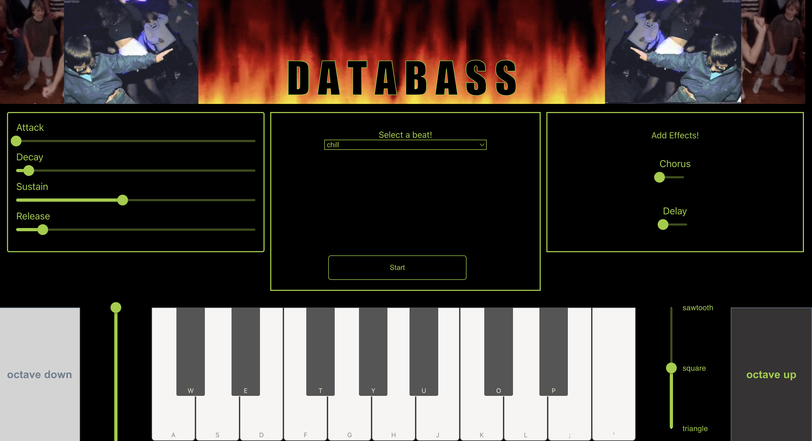

# Project Title

Hello! welcome to my project, "DATABASS". I hope you have fun!

## Overview

 it is a simple bass/chord synthesizer, designed to encourage learning about synthesis and experimenting with sound

### Problem

music production equipment, both hardware and software, can be very expensive. i want to try to make something that can be used for free by anyone
with an internet connection

### User Profile

musicians could implement this into their regular creative workflow, or non-musicians interested in playing around with synthesis or just music software in general, but don't want to commit to heavy costs of professional software

### Features

DATABASS includes a piano keyboard that is mapped to your computer keyboard, along with several basic controls to play with so you can tweak the sound you are generating. It also has a beat player section that calls in and loops beats for you to play along with!

### Tech Stack

react
node
sass
tone.js (web audio api)
mui

### Sitemap

instrument page -
    this will be a visual representation of a synthesizer,
    including a piano keyboard with 12 keys, and controls to 
    select different mode of audio output. for example, which type of soundwave to generate,
    octave switch, ADSR controls.

    It also includes a beats section that calls in and loops some beats I made for you to play along with! have fun!

### Mockups

### Data

My data comes in the form of .wav file 12 bar beats that i have made and served up from a basic backend server

## Nice-to-haves
There are lots of things I want to do with this project, one of the hardest parts was narrowing them down into things i could manage within the given timeframe.
Some things I would like to add in the future include:

-Patch Saving:
    I'd like to implement the ability to save your sound, the controls included allow you to make a lot of different sounds and i think it would be fun to build up a community bank of 'patches' for everyone to use.

-More Beats:
    You can never have too many choices when it comes to accompaniment beats to jam along with, so creating more and more to add to the server would be great.

-Themes:
    Some people may not like the zaniness of my original styling, so it would be fun to style this page multiple ways so that anyone could find something they like.

-More Effects:
    Currently the effects are pretty limited, and they are also only capable of 'on' and 'off' settings. I'd like to add more effects and also add the ability to change the parameters of each one, to finetune your sound even more.

-Recording and Exporting:
    It would be great to be able to record your jams and export them as a .wav or .mp3 file so you could share them with others, or use them as samples!

